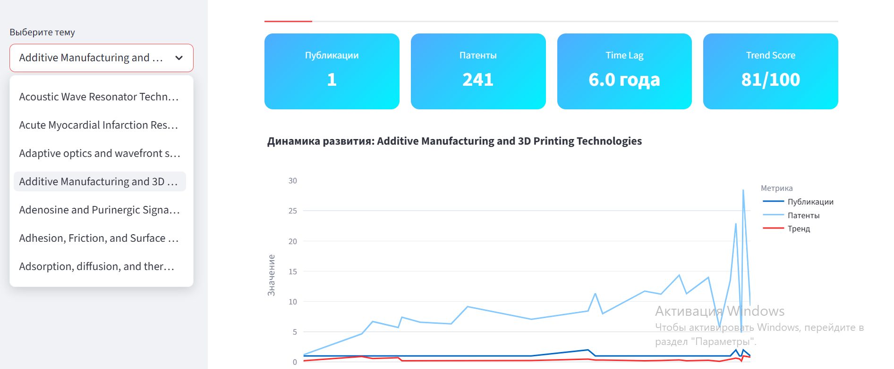
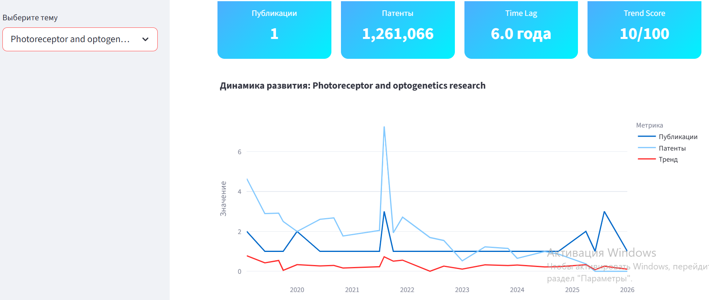

## Multi-Domain Tech Trend Engine

Проект разрабатывался как внутренняя platform-архитектура внутри существующего исследовательского репозитория стажировки.
В рамках работы была реализована новая production-style multi-domain структура проекта.

## О проекте

Проект представляет собой production-style MVP аналитической платформы, реализующей полный цикл:

```text
OpenAlex / Patents
        ↓
      ETL
        ↓
 Aggregation
        ↓
 Trend Metrics
        ↓
 FastAPI
        ↓
 Streamlit

```

Платформа поддерживает multi-domain архитектуру и позволяет независимо масштабировать технологические домены.

Реализованные домены:

•	Semiconductors

•	Gene Engineering

Каждый домен изолирован:

•	на уровне raw-данных,

•	ETL pipeline,

•	aggregation pipeline,

•	API,

•	dashboard layer,

•	processed datasets.

## Преимущества архитектуры

• Масштабируемость — возможность добавления новых технологических доменов.

• Модульность — независимое расширение ETL, analytics и API слоев без изменения общей архитектуры.

• Гибкость аналитики — возможность подключения новых метрик, dashboard-компонентов и аналитических пайплайнов.

## Архитектура проекта

```text
src/
├── analytics
├── api
├── dashboard
├── data
├── data_sources
├── domains
├── etl
└── pipelines
```
## Tech Stack

```text
Core
• Python

Data & ETL
• OpenAlex API
• Pandas
• Parquet
• BigQuery

Backend
• FastAPI
• REST API

Frontend
• Streamlit
• Plotly

Infrastructure
• Docker
• AWS EC2
```
## Основные возможности:

## Data Engineering

•	ETL pipelines

•	parquet processing

•	monthly aggregation

•	time series generation

## Analytics

•	trend metrics engine

•	trend_score

•	speed_score

•	time lag analytics

•	rolling smoothing

•	acceleration metrics

## Backend

•	FastAPI

•	REST API

•	caching

•	production cleaning

## Frontend

•	Streamlit dashboards

•	KPI cards

•	Plotly visualizations

## Infrastructure

•	AWS EC2

•	Docker

•	docker-compose

•	Linux deployment

## Docker Architecture

| Container | Port |
|---|---|
| api_semiconductors | 8001 |
| api_gene_engineering | 8002 |
| dashboard_semiconductors | 8506 |
| dashboard_gene_engineering | 8508 |

## Development Workflow

Основная разработка MVP велась в ветке:

•	analytics-mvp

Дополнительные исследовательские ветки:

•	doi_linkage_mvp — эксперименты с DOI linkage и NPL extraction

•	science-patents — исследования сопоставления scientific papers и patents

•	tech-trend-engine — ранняя версия trend analytics architecture

## Project Structure & Assets

Репозиторий включает:

• dashboard screenshots

• multi-domain architecture

• ETL / analytics pipelines

• deployment structure

• research branches

## Dashboard Preview

### Semiconductors Dashboard



### Gene Engineering Dashboard



